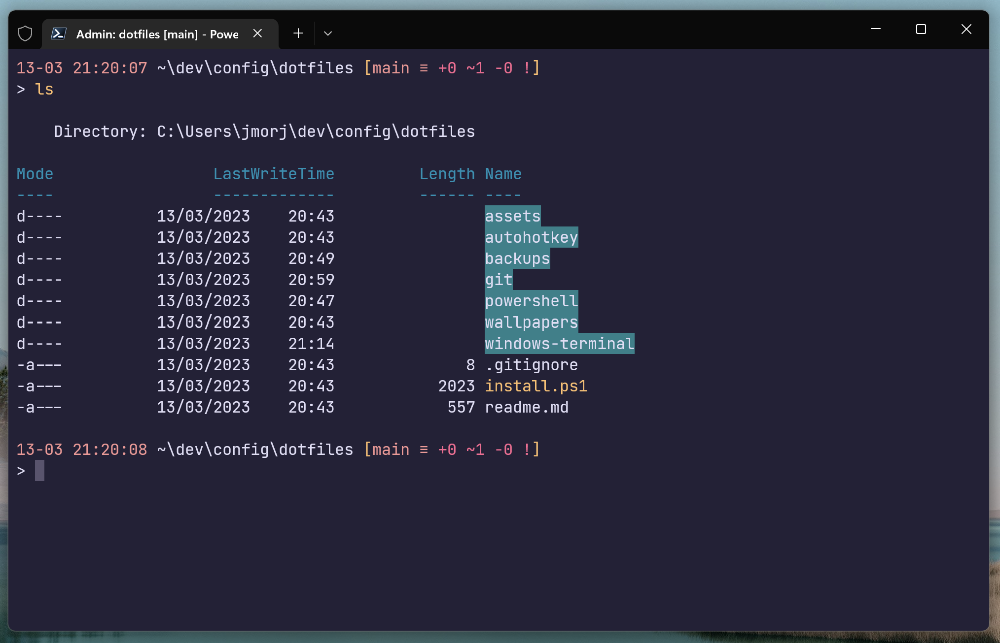

# dotfiles
My tools, configs and other bits & bobs.

- 🌳 global .gitconfig
  - username/email
  - aliases
  - push/pull upstream default behaviours
- 🖥️ windows terminal settings
  - theme ([rosé-pine](https://github.com/rose-pine/windows-terminal))
- 🐚 powershell profile
  - functions for frequent commands
  - choco
  - docker completion
  - psreadline/psfzf for command history search
  - posh-git pretty prompt

## Overview

- Focused on configuring my Windows development environment, but will be adding support for other platforms.
- Installs using a simple powershell script.
- Makes a backup of each file that's copied. Will be possible to restore from a backup (eventually).

## Installation
Clone the repo, run the script.

```
git clone https://github.com/jmorjsm/dotfiles.git
cd dotfiles/
. ./install.ps1
```
